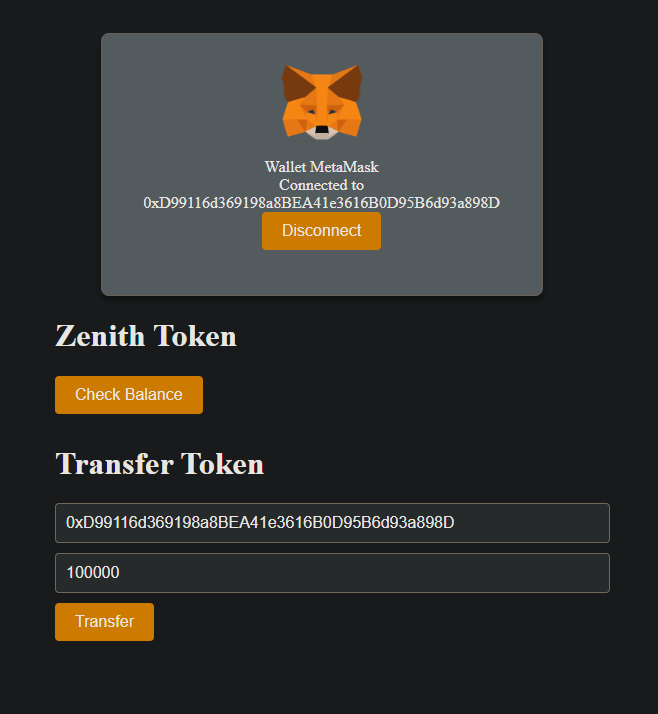

# ZenithToken-App



This project comprises two main directories:

1. **token_frontend**
2. **tokenContract**

These directories are independent and serve different purposes.

## 1. token_frontend

If you need a frontend for your ERC-20 token, follow these steps:

### Installation

```
npm install
```

### Configuration

```
const title = {
  mainTitle: "Your Token Name",
};

export default title;
```

In token_frontend/src/constants/abi/ZenithToken.json, replace the ABI with your deployed ERC-20 token's ABI.

Go to token_frontend/src/constants/contractAddress/address.ts and replace the address with your deployed token address:

```
const contract_Address = {
  zenithToken: "Your ERC-20 Token Address",
};

export default contract_Address;

```

Don't forget to add the RPC URL at token_frontend/src/App.tsx:

```
const { chains, publicClient, webSocketPublicClient } = configureChains(
  [polygonMumbai],
  [alchemyProvider({ apiKey: String(Add your RPC API here) })]
);

```

### Running the Frontend

```
npm run dev

```

Visit http://localhost:5173/ to view your token website.

## 2. tokenContract

If you want to create your own ERC-20 token, follow these steps:

### Installation

```
npm install

```

### Configuration

In tokenContract/hardhat.config.js, replace the network details with your desired deployment network:

```
module.exports = {
  networks: {
    hardhat: {},
    mumbai: {
      url: process.env.ALCHEMY_API_KEY, // Replace with your RPC endpoint
      accounts: [process.env.PRIVATE_KEY], // Replace with your private key for deploying
    },
  },
  solidity: "0.8.18",
};

```

In tokenContract/scripts/deploy.js, replace the ERC-20 token details:

```
const zenithToken = await ZenithToken.deploy(
  "Your Token Name", // Replace with your desired token name
  "TOKEN", // Replace with your desired token symbol
  18, // Replace with the desired number of decimals
  1000000 // Replace with the desired initial supply in ethers
);

```

### Deploying the Contract

```
npm hardhat compile
npx hardhat run --network scripts/deploy.ts

```

If you just want to run the project without creating a frontend or deploying a contract, you need to add a Polygon Mumbai RPC URL to token_frontend/src/App.tsx:

```
const { chains, publicClient, webSocketPublicClient } = configureChains(
  [polygonMumbai],
  [alchemyProvider({ apiKey: String(Add your RPC API here) })]
);

```

Then run:

```
npm install
npm run dev

```

Visit http://localhost:5173/ to see the website.

If you want to check the deployed Zenith Token on Polygon Mumbai, you can find it at https://mumbai.polygonscan.com/address/0xA5fB143361E8c4AC3dE3B809541B29945fe0cE47.

# Deployed Version

You can experience the live web app by visiting https://zenith-token-app.vercel.app/

# Visual Overview (How to use)

Here is go through of the website:


1. Click on the "Connect" button to integrate your Metamask wallet with the Zenith site.


2. MetaMask will open; provide your credentials to establish a connection between your wallet and the Zenith site.


3. Your connected account's "Public Address" will be displayed on the screen, updating dynamically when you switch wallets.


4. In this main section, clicking on "Check Balance" reveals your current token balance. If you wish to transfer tokens, enter the recipient's details in the "Send To" section. In the "Value" field, remember that "1 token = 1000000000000000000". Click on "Transfer", and your tokens will be securely sent to the specified address.


